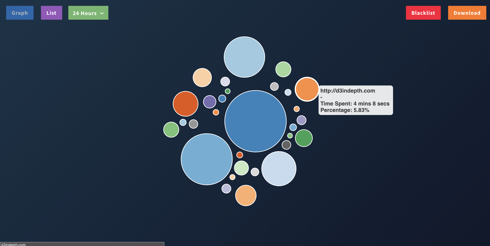

# ☁️ TimeCloud ☁️

TimeCloud is a chrome extension that visualizes the time you spend surfin' the web. Each circle in the cloud represents the time spent on a particular website. You have the ability to filter these items and view the result in both graph and list view.

Download it on the [Chrome Store](https://chrome.google.com/webstore/detail/timecloud/fdkedeclmfpbpdhoggmalbmnmjpfcoea)
